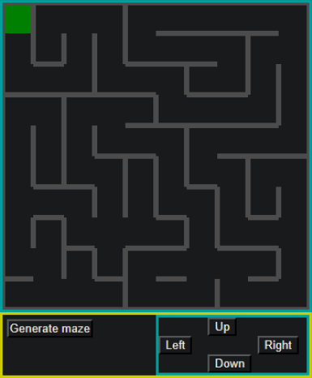

# MazeBattle

This project is live at endpoint http://mmaazzee.s3-website-us-east-1.amazonaws.com 

Generate random mazes then traverse them.

A Typescript project in the Angular framework. Maze generation using the recursive backtracker algorithm.

